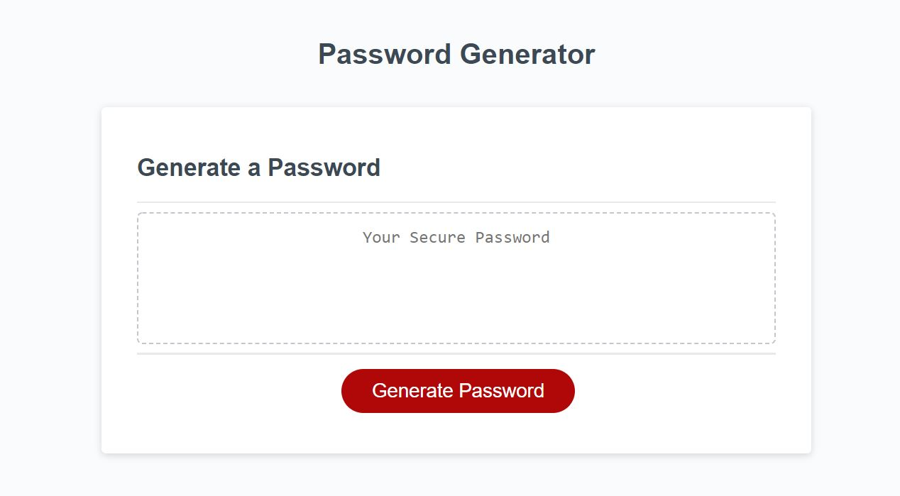
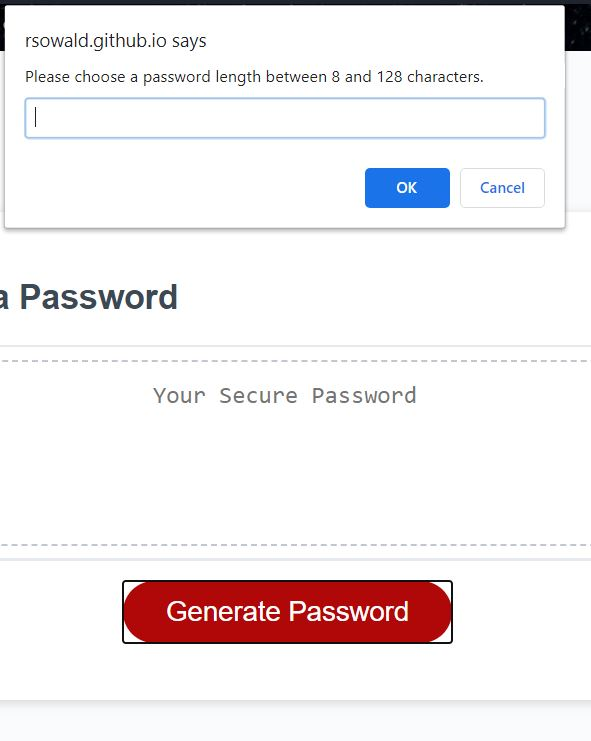
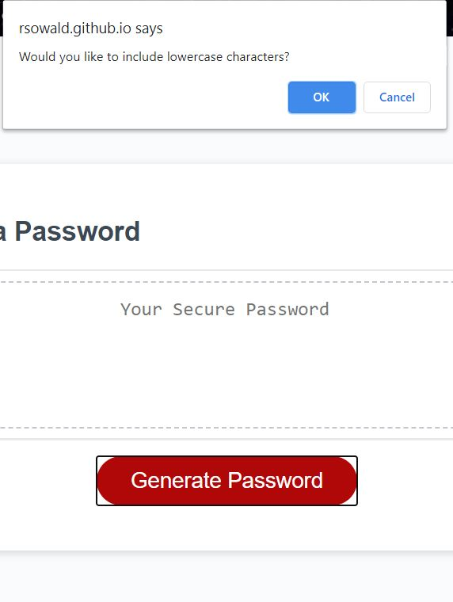
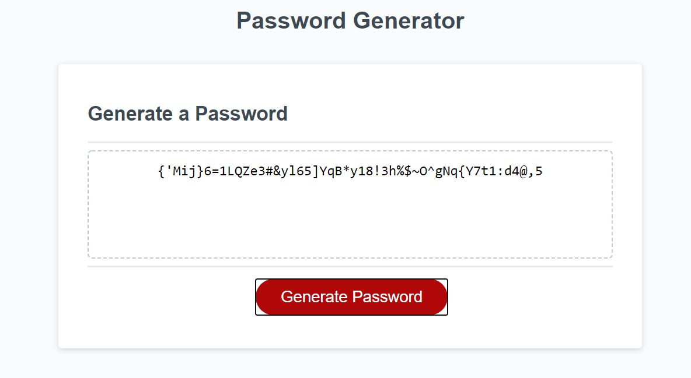

# PasswordGenerator

[View deployed application](https://rsowald.github.io/PasswordGenerator)

## About this Project
This project is a simple password generator that allows the user to select the password criteria. 

In a world of advanced technology and frequent internet usage, cyber security is constantly facing new challenges and making advances. Nearly every application a web user interacts with requires credentials. That is a lot of different passwords to come up with, or a great security vulnerability to reuse a password for many applications. One of the most basic ways to improve the strength of a password is to ensure that it is not based on a dictionary word. A random password generator supplies a better solution. This generator does limit the user to a range of 8-128 characters for a balance of a minimum level of security with a cap to avoid a password of ridiculous length. In fact, according the OWASP, passwords over 128 bits of entropy are considered impervious to brute force breaking attempts, so 128 characters already far surpasses that threshold. 

I started with a simple responsive user interface with an output field and a "Generate Password" button to initialize the application. Then, I used Javascript to provide prompt and confirm popup boxes for the user to select the criteria. I created two functions that ran in loops to collect the criteria and check for valid selections (ie the length has to be 8-128 characters and at least one character type must be selected). I then took the selected character types and made one string of the allowed characters. Finally, I chose random characters from that string within a for-loop to build a password string of the length specified by the user. The user may copy the returned password from the output field or write it down for memorization and later use.

## Usage
The application will begin on the landing page.

Pushing the "Generate Password" button will trigger a prompt.

If a correct length is input, a series of confirm popups will appear to ask about character criteria. Each may be answered with OK for a positive response or Cancel for a negative response.

If at least one character set is chosen, the generated password will appear in the password field.

## Future Features
- I would like to include a validation to check that at least one of each type of character that was confirmed true is included in the final generated password.
- There is debate over whether some special characters are more vulnerable to password crackers, so further research may warrant limiting available special characters.

## References
For excellent tips on password criteria and length:
https://www.csoonline.com/article/3228106/want-stronger-passwords-understand-these-4-common-password-security-myths.html